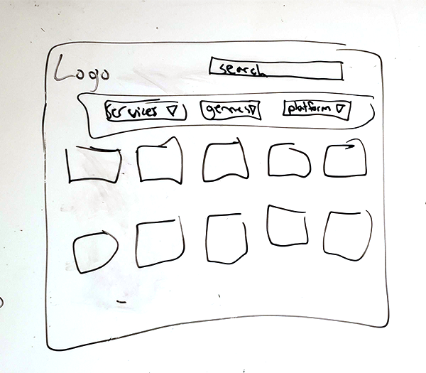
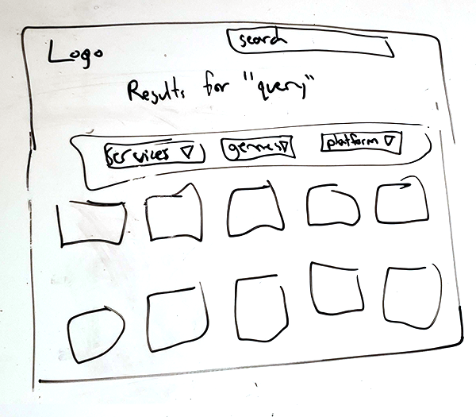
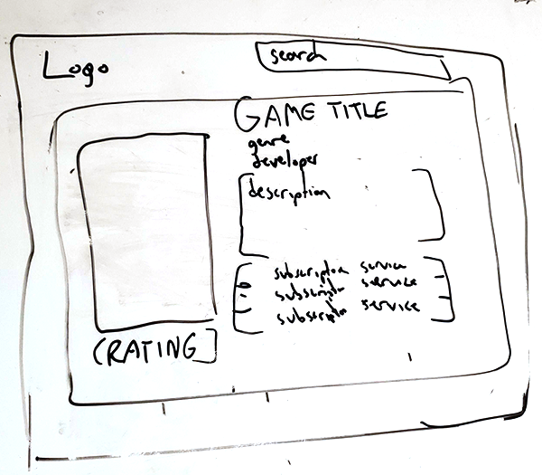

# Project Title

## Overview

A website called CanIPlayIt, which displays a wide database of video games on different platforms and services, that you can sort and search through to find various games and the services they're offered on - linking back to their proprietary stores.

### Problem Space

When someone wants to watch a show, they have to go look up which streaming service it's available on - Disney+, Netflix, etc. Similarly, many subscription and streaming services have emerged for video games in recent years - this site will provide that information quickly. If you have subscriptions for Humble Bundle, Game Pass, and Playstation Plus, you can just check here and see if you already have access to a game before going to buy it.

### User Profile

Gamers

- that play a lot of video games and have multiple subscriptions
- have multiple platforms to potentially play on

### Features

List the functionality that your app will include. These can be written as user stories or descriptions with related details. Do not describe _how_ these features are implemented, only _what_ needs to be implemented.

- As a user, I want to be able to filter the games library by subscription service
- As a user, I want to be able to filter the games library by genre
- As a user, I want to be able to filter the games library by platform
- As a user, I want to be able to search the games library for specific games to see where they're available

## Implementation

### Tech Stack

List technologies that will be used in your app, including any libraries to save time or provide more functionality. Be sure to research any potential limitations.

- React
  - libraries for searching and structuring the library
- Express server back-end
- MYSQL Database that's periodically updated or setTimeout.

### APIs

* External APIs will update the database periodically from the Xbox and Playstation store, which also has endpoints for Ubisoft+ and EA Play games available on those platforms.
* IGDB API will be used to populate missing data (such as description from the Playstation store call)

### Sitemap

- Home page and general library page with a nav bar for filtering by game, genre, or platform.
- Search results
- Game page, with all the information for that game in particular

### Mockups







### Data

3 SQL tables:

- Games
  - contains general information about each game (name, description, genre, image, developer, release date, platforms)
- SubscriptionServices
  - identifies each service with a unique id, name and description
- Game_Subscription
  - join table for many-to-many relationships, linking game ids and service ids
  - will enable the db to be updated with associations more easily

### Endpoints

* GET /platform?p=platformname

  * Returns an array of game objects from a particular platform.
* GET /genre?g=genrename

  * Returns an array of game objects from a particular genre.
* GET /subscription/:id

  * Returns an array of games that are available on a specific subscription service.
* GET /searchquery

  * Returns an array of game objects that match the search query.
* PUT /games

  * Updates game objects and the services associated with them
* POST /game_subscriptions

  * Creating the association between games and a particular subscription service
* DELETE /game_subscriptions

  * Removes associations between multiple games and a particular subscription service

Sample game object GET response:

```
[
    {
        "game_id": 1,
        "name": "Game Title 1",
        "description": "Description for Game Title 1",
        "image": "https://example.com/image1.jpg",
        "developer": "Developer 1",
        "release_date": "2022-10-01",
        "genre": "Action",
        "platforms": ["PC", "Xbox", "PlayStation"]
    },
    {
        "game_id": 2,
        "name": "Game Title 2",
        "description": "Description for Game Title 2",
        "image": "https://example.com/image2.jpg",
        "developer": "Developer 2",
        "release_date": "2021-06-15",
        "genre": "Action",
        "platforms": ["PC", "Nintendo Switch"]
    }
]

```

## Roadmap

* Populate the database, ensuring all fields are filled properly
* Build server with general calls
* Build client in react, with general front-end structure, routes and all pages
* Feature: Filter by service
  * Implement the ability to filter by service
  * create GET endpoint for that array
* Feature: Search for a game
  * implement the ability to populate search results from a query
  * create function to parse that database query and corresponding GET endpoint
* Feature: filter by genre
  * implement the ability to filter by genre
  * create GET endpoint for that array
* Finalize design and logo
* Bugfixing and QA testing for edge cases

---

## Nice-to-haves

* Ability to login as a user
* Ability to save your subscriptions to your profile, so the game database can reflect all games you have access to
* Wishlisting games so your profile receives an email alert when a game you've wishlisted is added to a service registered to your profile

---

## Future Implementations

* Price history and displaying the prices in different stores, with links going to those stores
* Wishlisting games so your profile receives an email alert when a game you've wishlisted is on sale below a price alert you've set
