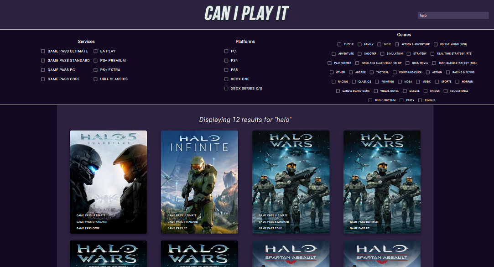

# 🎮 *Can I Play It* 🎮

## Overview

Can I Play It, a web applicaton which displays a wide database of video games on different platforms and services, that can be sorted through and searched to find various games and the services they're offered on

## Getting Started

This is an example of how you may give instructions on setting up your project locally.
To get a local copy up and running follow these simple example steps.

### Installation


#### 1. Install NPM packages.

- In both /client/CanIPlay and /server, run

  ```sh
  npm i
  ```
#### 2. Set up your database.

- Create a local mysql db named games, with an .env file providing its information to /server/knexfile.js

- In /server, run
  ```sh
  npx knex migrate:latest
  node /helper/insertGames.js
  ```
- This will load the database with the provided data in games.json, which has been gathered from various public APIs.

#### 3. Initialize the server.

- In /server, run

  ```sh
  node index.js
  ```

#### 4. Initialize the client.

- In /client/CanIPlay, run

  ```sh
  npm run dev
  ```

### Data Setup

- /server/helper/data/games.json comes prepopulated with game data, but with the provided API endpoints in an .env file, the data can be rebuilt locally.

- Navigate to /server/helper, then run these files:

#### 1. First, pull all the raw game data:
`node dataScraper.js`

#### 2. Next, we need to build game objects with the IDs we've received
`node xbGameBuilder.js`


#### 3. Then, pull PS+ and their Ubi+ Classics offering
   `node psGameBuilder.js`

#### 4. After that, we need to populate missing fields using the IGDB API
 `node updateIGDB.js`

#### 5. Now, sort through genres and collapse similar ones into one set
`node genreSet.js`

  - Check the log or data/failedGames.json to see if any failed to populate.

#### 6. Finally, your data should be updated and ready to enter the database!
`node insertGames.js`

As mentioned, the data is already provided - but if you want to try it yourself, these are the steps!

## Usage


From the home page, a user can click on a game, navigate through the pages of the database, search, or click on different categories to filter the database by subscription service, platform, or genre. 
  - Filters work with OR, not AND
  - Hovering over a game will pop up with the title and genres

####  Hover:


#### Sample search:



#### Game Page

 - The game page shows the game's description, developers, publisher, genres, and what subscription services it's available on.
 - Each of the subscription service boxes has a link to the homepage filtered by that service, and to the respective provider's site to sign up


### Tech Stack

- React
- Node & Express
- MYSQL 


### Data

10 SQL tables:

- Games
  - contains general information about each game (name, description, cover art)

- Publishers, Developers, Genres, Subscription_Services,Platforms
  - contains names and ids for each respectively

- Game_Developers_Join, Game_Genres_Join, Game_Platforms_Join, Game_Publishers_Join, Game_Subscriptions_Join
  - join tables to connect each game and its associated details


### Endpoints

* GET /games
 * returns all games in the database

* GET /games/?p=id
  * Returns an array of game objects from a particular platform.

* GET /games/?g=id
  * Returns an array of game objects from a particular genre.

* GET /games/?s=:id
  * Returns an array of games that are available on a specific subscription service.

* GET /games/?q=query
  * Returns an array of games found with a search query 

* GET /game/id
  * Returns detailed information for a specific game.


Sample game object GET response:

```
{
    "game": [
        {
            "game_id": 1,
            "name": "title",
            "description": "description",
            "image": "image_url",
            "release_date": "2018-03-23T05:00:00.000Z",
            "developers": [
                {
                    "name": "Developer",
                    "developer_id": 1
                }
            ],
            "publishers": [
                {
                    "name": "Publisher",
                    "publisher_id": 1
                }
            ],
            "platforms": [
                {
                    "name": "Platform",
                    "platform_id": 1
                }
            ],
            "genres": [
                {
                    "name": "Genre",
                    "genre_id": 1
                }
            ],
            "subscription_services": [
                {
                    "name": "Subscription Service",
                    "service_id": 1
                }
            ]
        }
    ]
}

```

---


## Future Implementations

* Humble Bundle inclusion, with a slider for users to identify their membership period and determine what games they have access to
* Ability to login as a user
* Ability to save your subscriptions to your profile, so the game database can reflect all games you have access to
* Wishlisting games so your profile receives an email alert when a game you've wishlisted is added to a service registered to your profile
* Price features and displaying the prices in different stores, with links going to those stores
* Wishlisting games so users can receives an email alert when a game you've wishlisted is on sale below a price alert you've set
